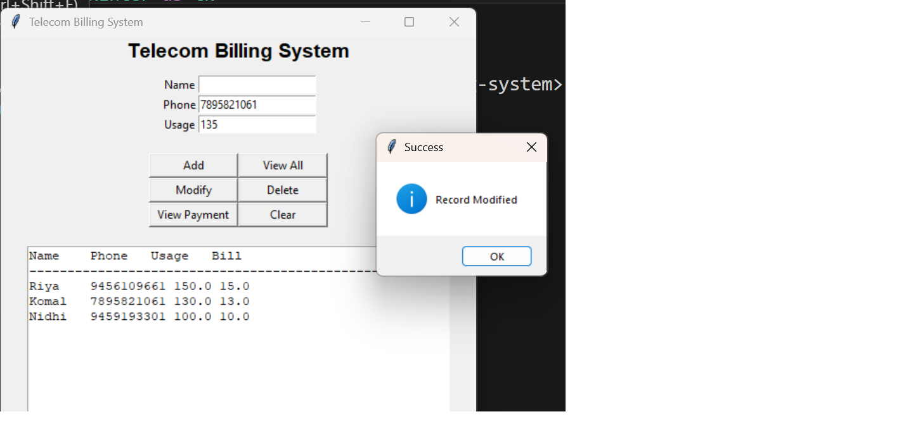

# Telecom Billing System

A Telecom Billing System with C-based core logic and a Python GUI.

## Description
This project implements a Telecom Billing System where the core 
business logic is written in C and a graphical user interface is 
built using Python (Tkinter).

Customer data is stored permanently using file handling.

## Features
- Add new customer records
- Modify existing records
- Delete records
- View all customer records
- Persistent storage using files
- GUI interface for user interaction

## Technologies Used
- C Programming
- Python
- Tkinter (GUI)
- File Handling

## How to Run

### Run C backend:
gcc telecom.c -o telecom

### Run GUI:
python app.py

## Sample Output

